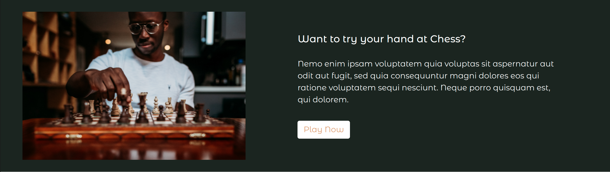
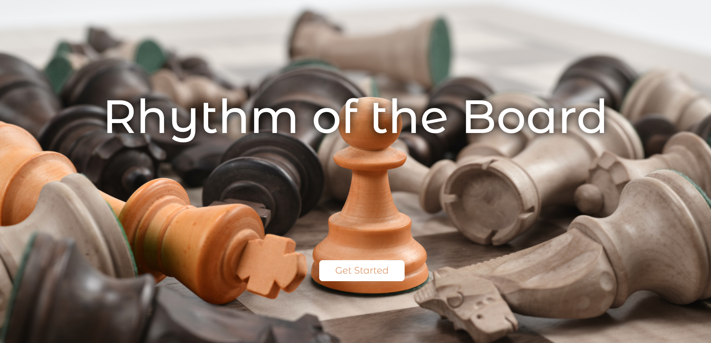
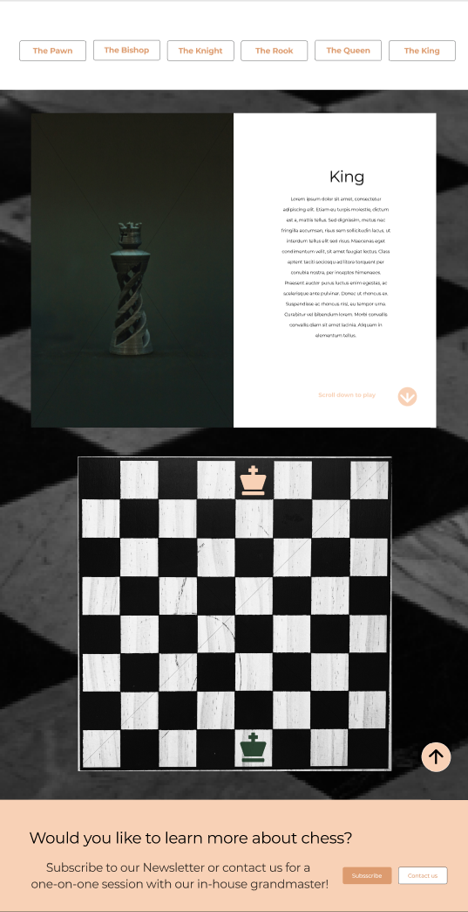

# RHYTHM OF THE BOARD
## Rhythm of the Board (Chess Game)

 

A web application that intorduces beginners in chess to the dynamic move of the chess pieces. It gives them a insight on the inportance of chess pieces, their valid moves and creates a space where they can practice and grow! 
 

### Contributors
 Ngina Gitau @Ngina-G  
 Jeff Owuor @Jeff-Owuor  
 Cindy Kemunto @C-Ogamba  
 Prince Ntaba @Princentaba1

 

### Landing Page

 

### Check live demonstration <a href="https://sparkling-pavlova-c7651e.netlify.app/"><strong>here</strong></a>
 
 
## Description
For many beginners, chess seems overly complicated and unnecessarily difficult. Often  being passed over for other less mentally taxing taxing board games during game night. With each piece moving in its own unique way, chess can take time to learn and master. Our product gives people curious about chess, beginners and master who want to refresh their skills the opportunity to understand the way each piece moves. We offer a fun and interactive way to become a Grand-master with patience and practice.

### How To
Upon opening the page, the user is greeted with a brief introduction to Chess and using several buttons can navigate to the <strong>Play page</strong>. This is where the user will be introduced to the default and most important piece "the King". From here the user can navigate to different pieces where the layout is similar to that of the king.
 
There after in each 'piece play page' , the user can see how the pieces move and intereact with the board to see the valid chess moves for each piece.
  
If the user is facing any challenges, they can contact us through the appropriate buttons or subscribe to the weekly newsletter.

<i>The contact and subscribe button are for display only as this is a demo site</i>
 

#### Requirements
JSFiddle or JavaScript Console

### Setup Instructions and Installation
Fork or clone this repository to a location in your file system. git clone https://github.com/Ngina-G/Chess-game.git
Open terminal command line then navigate to the root folder of the application. cd Ngina-G.github.io
Open index.html on your Browser.

### Behavior Driven Development 
<dl>
<dt>Displays landing page with CTAs to navigate to the playing pages</dt>
    <dd>INPUT: "Clicks on the button"</dd>
    <dd>OUTPUT: "Displays default Play Page "The King"</dd>
<dt>User clicks on the Chess Piece Icon</dt>
    <dd>OUTPUT: "Board highlights the possible valid moves for that piece"</dd>
<dt>Clicks on the contact/subscribe button</dt>
    <dd>OUTPUT: "Navigates to the corresponding page"</dd>
</dl>

### Known bugs
If you find a bug (the website couldn't handle the query and or gave undesired results), kindly open an issue here by including your search query and the expected result.

If you'd like to request a new function, feel free to do so by opening an issue here. Please include sample queries and their corresponding results.

## Technologies Used
HTML, CSS and JAVASCRIPT.

### License
 MIT License

Copyright (c) 2022 Ngina

### Disclaimer
The user information is private and will not be collected for any purposes other than to return the function specified in the app.

### Contact Me
Visit my website here: https://www.nginagitau.com/
If you have any questions or comments, 
conatct me at Nginagitau11@outlook.com

### TO DO
Include interactivity that allows the user to move more than one chess piece.

